# Atividade em equipe:
* Ézio Alves
* Douglas Barbosa
* Kaleb Zimmermann
* Pedro Medeiros

# EXPLORANDO A BIBLIOTECA PANDAS

<p>A principal tarefa para engenheiros quando desejam trabalhar com Machine Learning e realizar análise de dados para determinar a viabilidade de encontrar tendências, e então criar um "pipeline" efieciete para treinar o modelo. Este processo envolve
usar bibliotecas como NumPy e Pandas para manipular dados, em conjunto com frameworks como TensorFlow/Keras/PyTorch.</p>

<p>O pandas é muito útil para trabalhar com dataframes, (dataframes é basicamente uma tabela que contém linhas e colunas).</p>
<p>Na figura abaixo temos um exemplo de Dataframe, a área destacada em vermelho é o indice criado automaticamente pela função DataFrame do Pandas Python .</p>


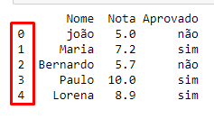
<p>Neste tutorial utilizarei o Jupyter Notebook como ferramenta para desenvolver e executar os códigos.</p>

## Guia de instalação
<p>Para que você possa estar acompanhando este tutorial e também executando em sua máquina este passo a passo, certifique se de que já tenha o Python instalado em seu computador, para consultar se o Python já está instalado, abra o Prompt de comando CMD do windows, e execute o comando python, com isso deverá aparecer Python e sua versão, no MAC ou Linux acesse o Terminal e ao invés de digitar apenas Python, digite Pytonh3.
</p>

<p>caso não tenha o Python instalado, acesse o site oficial do Python, <https://www.python.org/> 
em seguida clique em download e será guiado para página de download  da versão, conforme a ilustra a imagem a seguir, para instalar a última versão clique no botão amarelo conforme aponta a seta 02, então o download será inicializado, após concluir o download, vá até a pasta Python que foi baixada (possivelmente estará na pasta downloads), e clique no executável para efetuar a instalação, todo o processo consiste basicamente clicar  em install, next, next… e finish.</p>

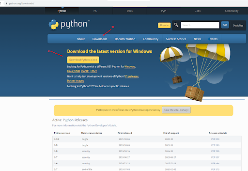

<p>Para instalar o Jupyter notebook, basta instalar o Anacondas que já está com Jupyter Notebook integrado.
Instalando o Anaconda, para isso acesse o site do Anaconda, <https://anaconda.org/>
</p>
<p>Clique em Download anaconda </p>


<p>Após clicar em download Anaconda, que irá te guiar para página seguinte,  role a página até o rodapé e selecione a versão que mais se enquadra com o seu sistema operacional, no meu caso estou usando o windows 64-bit</p>

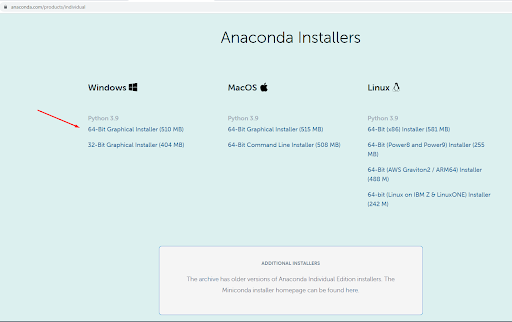

<p>Após efetuado o download, vá até a pasta baixada e clique no executável para efetuar a instalação.</P>

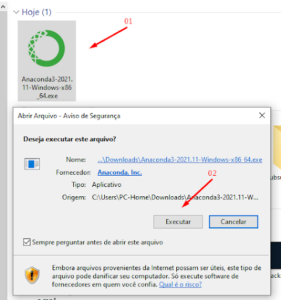
<br>
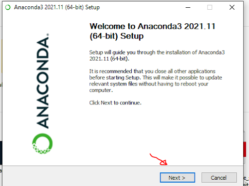

<p>Leia e aceite o termo de licença.</P>

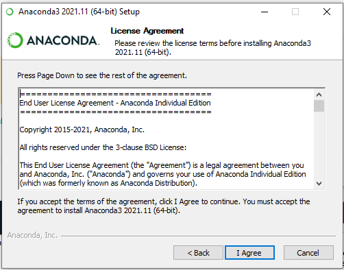
<br>
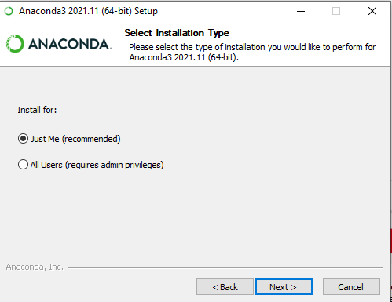

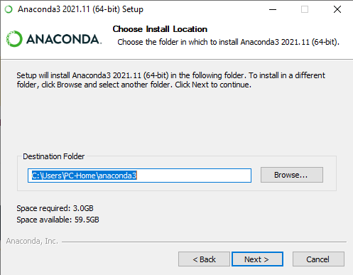

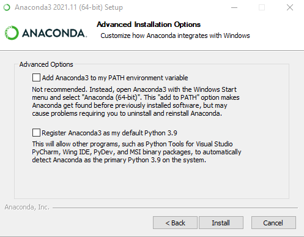


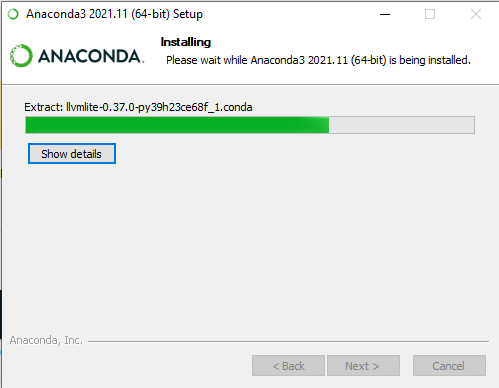

<p>Aguarde a conclusão do Download.</P>

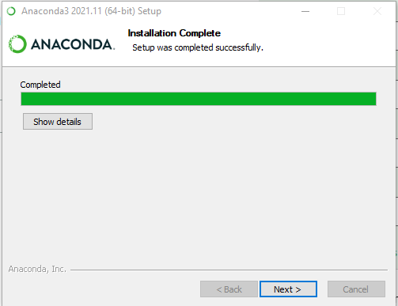

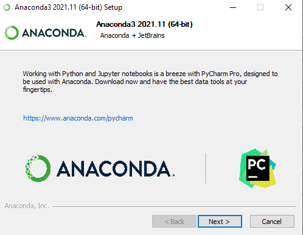
<p>Clicque em finish, para finalizar a instalação.</P>

<p>Usuário  Windows, após instalação do Anaconda, vá para o campo de pesquisa, no canto inferior esquerdo e digite Anaconda navigator e clique em: Anaconda Navigator para abri-lo.</p>
<p>Veja a quantidade de ferramentas disponíveis do pacote anacondas e ainda contamos com uma série de bibliotecas já embutida.</p>

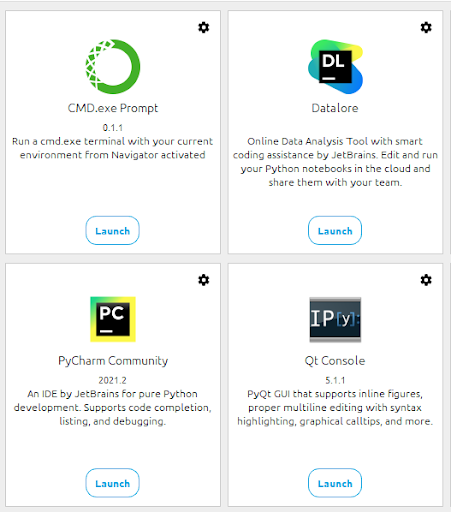

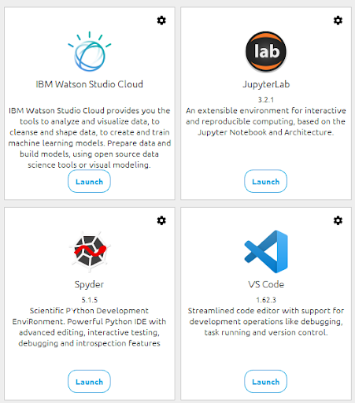

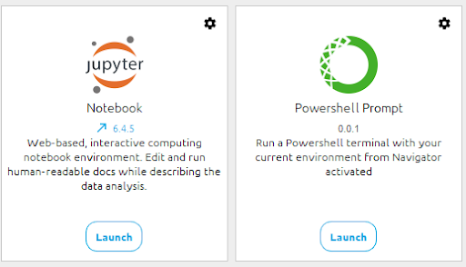
<p>A ferramenta que iremos utilizar para executar o nosso código será o Jupyter Notebook
com Anaconda Navigator aberto basta clicar em Launch no quadro Jupyter notebook, conforme ilustra imagem abaixo:</p>

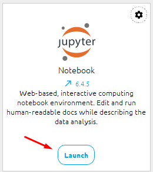

<p>outra opção para usuário do Windows abrir o Jupyter, basta buscar por Jupyter Notebook na area de pesquisa no canto inferior esquerdo e selecionar Jupyter Notebook, e também pode optar por abrir o prompt de comando do windows e digitar Jupyter notebook e teclar enter, ao ambiente para desenvolvimento estará aberto conforme ilustra a figura abaixo.</p>

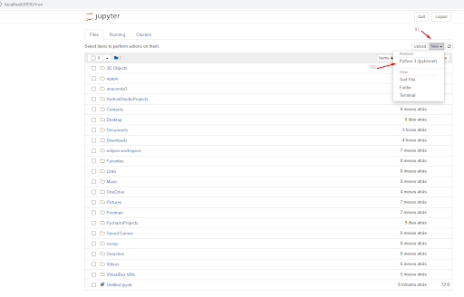

<p>Em seguida clique em New, no canto superior direito, e depois clique em Python 3 (ipykemel).</p>

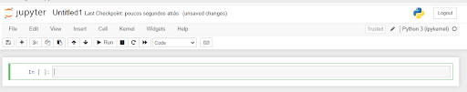

<p>para execução dos nossos código será necessario a instalação da biblioteca Pandas, portanto abra o prompt de comando CMD ou equivalente e execute o comando >>> pip install pandas</p>

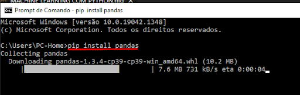


# Tratamento de Dados no Python
## Introdução ao Pandas

<p>Pronto já podemos iniciar o nosso trabalho com o código.</p>

### Obs: Para execução dos códigos, teremos como base instruções do canal Didática Tech
### Acesse o site: [Didática Tech](https://didatica.tech/)
### Canal [Didática Tech no YouTube](https://www.youtube.com/watch?v=an54pc9BW4I)


-------------------------------------------------------------------------------------------------

### Criando um dicionário python
<p>nota: dicionário é um conjunto de dados contendo chave e valor, chave sempre a esquerda dos : (dois pontos), e logicamente o valor a direita dos dois pontos, obs: o valor pode receber uma lista, seja strings, inteiros, floats etc.</p>
Obs2: dicionário está sempre entre chaves{}, lista entre colchetes[] e tuplas entre parênteses().
</br>

```python
import pandas as pd  #importação da biblioteca Pandas do Python, em: "as pd" estou apelidando pandas como "pd". 
```

```python

alunos = {'Nome':['joão', 'Maria', 'Bernardo', 'Paulo', 'Lorena'],    # Dicionário alunos
            'Nota':[5, 7.2, 5.7, 10, 8.9],
            'Aprovado':['não', 'sim', 'não', 'sim', 'sim']}
```
```python
print(alunos) #para imprimir o dicionário alunos, para verificar como ficou

```
<p>Clique em "Rum" e veja a saída conforme ilustra a figura abaixo:</p>

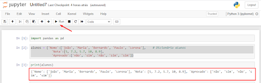

### Criando um DataFrame a partir de um dicionário python

```python
alunos_df = pd.DataFrame(alunos)  # criação de um DataFrame a partir do dicionário alunos sendo atribuiído a variável alunos_df
```
```python
print(alunos_df) #print para imprimir o DataFrame alunos_df
```
<p>Clique em Rum novamente para executar o código e veja o resultado da saída conforme ilustra abaixo</p>

```python
       Nome  Nota Aprovado
0      joão   5.0      não
1     Maria   7.2      sim
2  Bernardo   5.7      não
3     Paulo  10.0      sim
4    Lorena   8.9      sim
```

### Criando um objeto Series a partir de um dicionário python

```python
obj = pd.Series([3, 9, 6,4, 7, 0])

```
```python
print(obj) #peço para imprimir o objeto criado

```
<p>Note que foi impresso os dados destacado em azul, dados "lista" passado entre colchetes e a área destacada em vermelho, foram os índices criados automaticamente pelo comando series, note também que ele informou o tipo de dado, sendo int e o tamanho 64 bit</p>

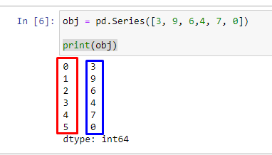

<p>Obs: o objeto do tipo series é capaz de armazenar apenas um vetor unidimensional, isso é útil para quando estamos querendo trabalhar com apenas uma coluna de dados de uma planilha.</P>
<p>Obs2: O objeto series aceita quase todos os comados Pandas utilizado no DataFrame.</p>

### Comando "head" do Pandas
```python
alunos_df.head()

```
<p>O comando "head" serve para imprimir as primeiras linhas de um DataFrame, note que fica parecido com o comando "print", mas com algumas diferenças, tipo, fica em negrito o cabeçalho da tabela, gera um sombreado alternado entre as linhas, e quando "passa o mouse" sobre a tabela, a linha que se encontra a seta do mouse muda de cor .</p>

### Comando "shape" do Pandas
```python
alunos_df.shape

```
```python
(5, 3)    # resultado do comando shape, informando quantas linhas quantas colunas possui o DataFrame alunos_df, sendo 5 linhas e 3 colunas.

```
### Comando para função "describe" do Pandas

```python
alunos_df.describe()

```

```python
Nota
count	5.000000  # Aqui o describe informa quantos dados possui com base no número de linhas
mean	7.360000  # Valor da média
std	2.103093  # Desvio padrão
min	5.000000  # Valor mínimo
25%	5.700000  # Percentil 25
50%	7.200000  # Percentil 50
75%	8.900000  # Percentil 75
max	10.000000 # Valor máximo
```
## Filtrando dados em um DataFrame

### Filtrando colunas em um DataFrame
<p>Para filtrar uma coluna, basta passar o nome da coluna entre aspas dentro dos colchetes no Dataframe, conforme ilustração abaixo</p>

```python
alunos_df['Aprovado'] # filtrar apenas a coluna Aprovados
```
```python
0    não
1    sim
2    não
3    sim
4    sim
Name: Aprovado, dtype: object
```
### Filtrando linhas em um DataFrame, comando "loc"

```python
alunos_df.loc[[0]]  # entre colchetes informo o índice  que quero filtrar
```
```python

Nome	Nota	Aprovado
0	joão	5.0	não    # resultado para índice zero.
```

```python
alunos_df.loc[1:3] # é possivel especificar a faixa em que quero filtrar, nesse exemplo do índice 1 ao índice 3
```

```python

    Nome	  Nota      Aprovado
1	Maria     7.2	       sim
2	Bernardo  5.7          não
3	Paulo	  10.0	       sim
```

### com o comando "loc" podemos fazer filtros mais específicos
<p>No exemplo a seguir iremos filtrar "buscar", em nosso DataFrame todos dados em que aprovado seja "sim" </p>

```python
alunos_df.loc[alunos_df['Aprovado']== 'sim']
```
```python
	Nome	Nota	Aprovado
1	Maria	7.2 	sim          # impressão dos dados
3	Paulo	10.0	sim
4	Lorena	8.9 	sim
```
<p>com isso é possível filtrar qualquer dado em um data frame, passando o nome da coluna e o dado que queira pesquisar</p>
<p>Obs: cuidado sempre com as letras maiúsculas e minúsculas pois se diferenciam, podendo comprometer a busca</p>

# Construindo um DataFrame a partir de outro DataFrame

<p>Com Pandas, podemos construir um DataFrame a partir de outro Dataframe,essa funcionalidade é muito útil quando temos um volume grande de dados e desejamos trabalhar apenas com uma pequena porção desses dados</p>

```python
alunos_df2 = alunos_df.loc[0:2]
```
```python
print(alunos_df2)
```
<p>Note que abaixo todo DataFrame alunos_df2 foi impresso contendo os dados da linha zero até a dois que foi o intervalo solicitado solicitado entre colchetes >>[0:2]. </p>

```python
       Nome  Nota Aprovado
0      joão   5.0      não
1     Maria   7.2      sim 
2  Bernardo   5.7      não
```
<p>Dica importante! usando essa técnica de copiar os dados de um DataFrame para outro, você pode manipular seus dados sem medo de cometer qualquer erro, por exemplo excluindo algum dado sem querer, já que com isso você terá o backup em seu DataFrame principal.</p>

## Construindo um DataFrame a partir de outro DataFrame utilizando condição.
<p>Filtro para 6 como nota de corte.</p> 

```python
aprovados_df = alunos_df.loc[alunos_df['Nota'] >= 6]
```
<p>Com isso é possível filtrar e armazenar dentro de outro DataFrame, apenas os alunos de uma turma que tiveram nota maior ou igual a 6.</p>

<p>Obs: poderia utilizar qualquer operador lógico conforme necessidade para filtrar, Ex: igual ==, diferente !=, maior >, menor <, menor ou igual <=.</p>

```python
print(aprovados_df)  
```
```python
     Nome  Nota Aprovado
1   Maria   7.2      sim
3   Paulo  10.0      sim
4  Lorena   8.9      sim
```
## Manipulando arquivo externo atavés do comando "read"
<p>Fazendo uso da biblioteca Pandas do Python é possível manipular documentos externos, documentos esses que, sua estrutura esteja organizados em forma de linhas e colunas, como por exemplo uma planilha Excel, ou um arquivo com extensão .csv etc. </p>

<p>Para isso faremos um teste utilizando um arquivo pronto baixado do keggle</p>

<p>Para isso crie uma conta no site do Kaggle clicando no link a seguir</p>

[Acesso ao site: kaggle.com](https://www.kaggle.com).

#### Baixe o arquivo athlete_events.csv que iremos manipular [Link Download do arquivo](https://www.kaggle.com/heesoo37/120-years-of-olympic-history-athletes-and-results).

<p>Nesta planilha estão os dados de todos os atletas que participaram das olimpiadas desde as olimpiadas de 1896 até as olimpiadas de 2016 no Rio de Janeiro.</p>


<p>Nota: Keggle é uma comunidade de aprendizado de Machine Learning and Data Science (aprendizado de máquina e ciência de dados)</p>

<p>Neste exemplo pegamos o arquivo baixado e armazenaremos em uma variável chamada teste.</p>

```python
import pandas as pd
teste = pd.read_csv('C:/Users/PC-Home/Downloads/athlete_events.csv')
```
<p>Obs: para que funcione descompacte o arquivo baixado e ao informar o caminho inverta as barras do caminho do arquivo .</p>
<p>Por que "_csv" logo após pd.read? R= Porque csv é a extensão do arquivo, se fosse um arquivo Excel deveria ser passado logo após o pd.read  "_xlsx", não esquecendo de preceder com underscore.</p>

<p>Feito isso, podemos por exemplo, pedir para imprimir as 7 primeiras linhas do arquivo, fazendo uso do comando head e passando a quantidade de linhas desejadas entre parênteses "chamada para o método" da função head. </p>

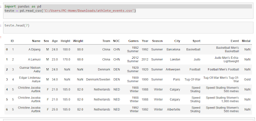

## Através do comando "reaname" podemos renomear as nossas colunas
<p>Neste exemplo será modificado o nome das colunas que estão em Inglês para Português</p>

```python
teste.rename(columns={'Name': 'Nome', 'Sex': 'Sexo', 'Age': 'Idade', 'Height': 'Altura', 'Weight': 'Peso', 'Team':'Equipe', 'Games': 'Jogos', 'Year': 'Ano', 'Season': 'Temporada', 'City': 'Cidade', 'Sport': 'Esporte', 'Event': 'Evento', 'Medal': 'Medalha' })
```
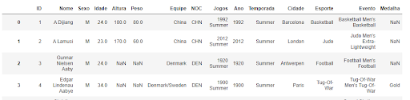

## Fuçao do Pandas para fazer contagem
Fazer contagem com a função "value_conts()" do Pandas

<p>Neste exemplo será feito uma filtragem da coluna desejada, neste caso será "Medalhas" pedindo para contar quantas vezes o mesmo dado se repetem</p>

```python
 teste['Medal'].value_counts()
```
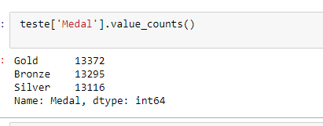

# Excluir uma coluna no DataFrame usando o comando "drop".

<p>Neste exemplo faremos a exclusão da coluna "ID" e da coluna "Season"</p>

```python
teste.drop('ID', axis = 1, inplace=True)
teste.drop('Season', axis = 1, inplace=True)
```
<p>Obs: "axis" representa o eixo do plano cartesiano, se 1 representa abscissa eixo "x" >> coluna, se 0 representa ordenada o eixo "y" >> linha).<p>

<p>Obs2: inplace=True, diz que deve permanecer no lugar</p>
<p>Veja abaixo o resultado das saídas, note que após o comando drop, a área destacada em vermelho, não temos mais a coluna "ID" e "Season".</p>

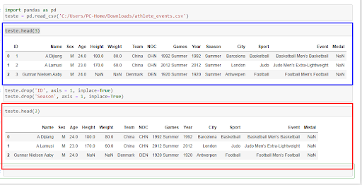

## Criando histograma com Pandas
<p>Para fazer a impressão do gráfico será necessário a importação a biblioteca matplotlib.pyplot</p>

```python
import matplotlib.pyplot as plt # importação da biblioteca

```
<p>Para criar o histograma, é necessário passar por parâmetro qual coluna que deseja realizar o estudo </p>

```python
teste.hist(column='Age', bins=10)
plt.show() # comando para imprimir o gráfico

```
<p>Obs: "bins", representa o número de barras que o gráfico irá imprimir para representar a variação entre os dados, portanto se colocar um número bem maior no "bins" teremos uma melhor representação das variações, faça também o teste modificando o valor de 10 para 100.</p>

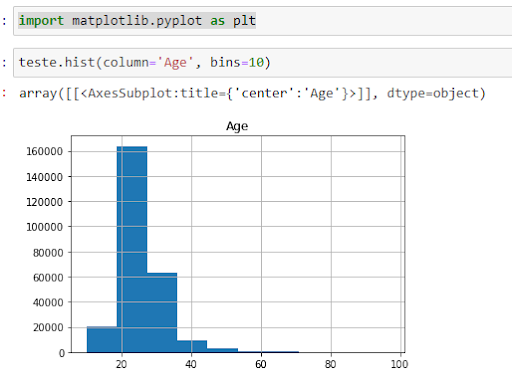

## Box Plot
<p>O box plot é bastante útil para identificar os Outliers (pontos fora da curva), ou seja os dados que estão acima ou abaixo da curva normal</p>

```python
import matplotlib.pyplot as plt
teste.boxplot(column='Age')
```
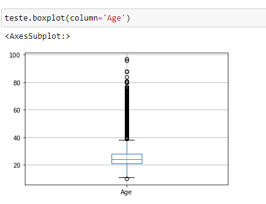

<p>É possivel criar varios boxplot em uma única impressão, para isso basta colocar os dados das colunas em que deseja fazer impressão em forma de lista.</p> 

```python
teste.boxplot(column=['Age','Height','Weiht'])
```
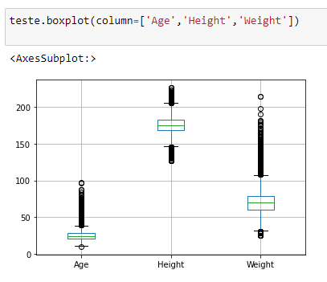


## Criando gráficos utilizando a biblioteca matplotlib

<p>criaremos um gráfico que relaciona o Peso e Altura dos atletas masculino do Dataset atletas das olimpiadas</p>  

```python
import matplotlib.pyplot as plt
masculinos = teste.loc[teste['Sex'] =='M'] # criando novo Dataset camado masculino contendo apenas os atletas masculino
altura = masculinos['Height']
peso = masculinos['Weight']

```
```python
plt.scatter(altura, peso)
plt.show()
```
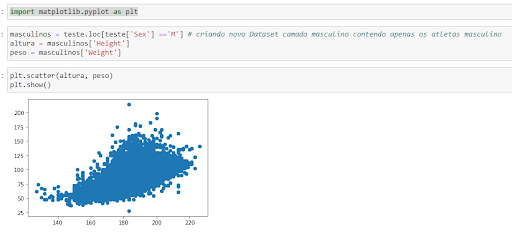

